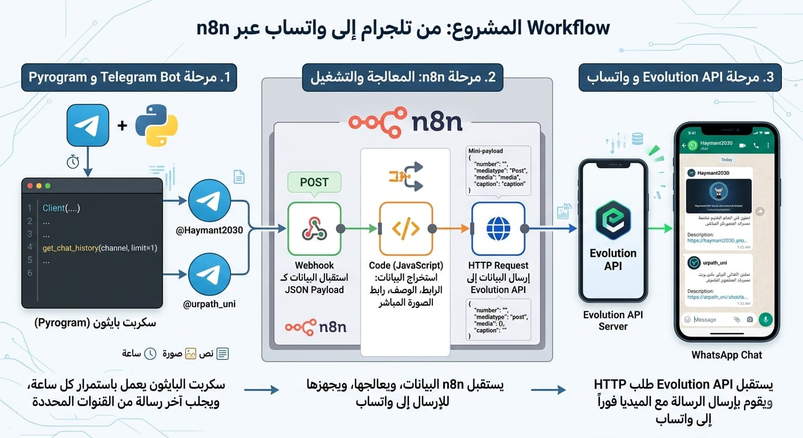

### 🚀 Telegram-to-WhatsApp Automator

هذا المشروع عبارة عن نظام أتمتة (Automation Workflow) يقوم بسحب المحتوى (هاكاثونات، أخبار، تحديثات) من قنوات تيليجرام محددة وإعادة إرسالها تلقائياً إلى الواتساب عبر تكامل بين `Pyrogram` و `n8n` و `Evolution API`.

---

## 📋 نظرة عامة على سير العمل

يعتمد المشروع على ثلاث مراحل أساسية:

1. **مرحلة تيليجرام (المصدر):** سكربت بايثون يستخدم مكتبة `Pyrogram` يقوم بمراقبة قنوات تيليجرام وجلب آخر رسالة (نص/صورة) بشكل فوري.
2. **مرحلة المعالجة (n8n):** يستقبل طلب `POST` عبر `Webhook` يحتوي على بيانات الرسالة، يقوم بمعالجتها وتنسيقها (JSON Payload).
3. **مرحلة الإرسال (WhatsApp):** يتم إرسال الطلب إلى `Evolution API` الذي يقوم بدوره بإرسال الرسالة إلى الواتساب.

> 

---

## 🛠 المتطلبات

قبل البدء، تأكد من توفر الأدوات التالية:

### 1. بيئة العمل (Telegram Bot)
* **Python 3.11+**
* **مكتبات البايثون:**
    * `pyrogram`
    * `httpx`
    * `tgcrypto`
* **بيانات تيليجرام:**
    * `API_ID` و `API_HASH` (يمكن الحصول عليها من [my.telegram.org](https://my.telegram.org)).
    * `Session String` (للبدء المباشر دون الحاجة لتسجيل دخول متكرر).

### 2. بيئة المعالجة (n8n)
* مثيل (Instance) لـ **n8n** (سواء كان ذاتي الاستضافة Self-hosted أو سحابي).
* عقدة **Webhook** لاستقبال البيانات.
* عقدة **Code** (JavaScript) لمعالجة النصوص والروابط.
* عقدة **HTTP Request** لإرسال البيانات.

### 3. منصة الإرسال (WhatsApp)
* مثيل من **Evolution API** مرتبط برقم واتساب فعال.

---

## ⚙️ طريقة الإعداد

### أولاً: إعداد سكربت البايثون
1. قم برفع السكربت على منصة استضافة (مثل **Railway** أو **VPS**).
2. تأكد من ضبط متغيرات البيئة (أو وضعها مباشرة في السكربت):
    - `API_ID`
    - `API_HASH`
    - `SESSION_STRING`
    - `N8N_WEBHOOK_URL`
  

### ثانياً: إعداد n8n Workflow
1. أنشئ Workflow جديد.
2. أضف **Webhook Trigger** مضبوط على طريقة `POST`.
3. أضف عقدة **Code** لتنسيق البيانات (استخراج الوصف والروابط).
4. أضف عقدة **HTTP Request** واضبطها لتخاطب `Evolution API`.

---

## 💡 المميزات

* **نظام استماع فوري (Event-driven):** لا يقوم البوت بالعمل كل ساعة فقط، بل يستمع فوراً عند وصول أي رسالة جديدة للقنوات.
* **إدارة الذكاء:** يقوم بفلترة الرسائل الفارغة وحساب عدد الرسائل المجمعة قبل الإرسال.
* **استقرار عالٍ:** تم ضبط السكربت للعمل بشكل مستمر في البيئات السحابية (Cloud Environments) دون توقف.
* **نبض نشاط (Heartbeat):** يتضمن خاصية إرسال "إشارة نشاط" لضمان بقاء n8n فعالاً وعدم دخوله في وضع الخمول.

---

***
*صُمم هذا المشروع لأتمتة متابعة قنوات الهاكاثونات والأخبار التقنية.*
